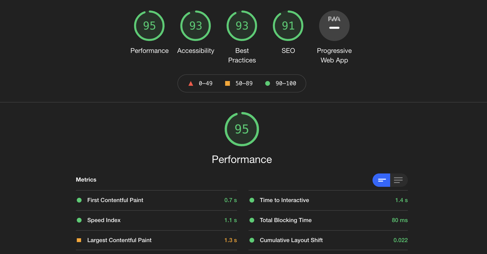

# Food Trucks of San Francisco

There are hundreds of food trucks in San Francisco, and this handy one-page map app helps you look through them all. Just click on a marker on the map to see the name of the food truck, the address, what kinds of items you can expect to find on the menu, and their operating hours. While most maps give you the standard google color scheme, this one adds some beauty to your food truck finding experience with a custom color scheme.

The live site can be found here: [Food Trucks of San Francisco](https://quizzical-spence-9f3205.netlify.app/)

## Architecture
This is a React based app that utilizes two external APIs - [Mobile Food Facility Permits](https://data.sfgov.org/Economy-and-Community/Mobile-Food-Facility-Permit/rqzj-sfat) from DataSF and [Google Maps API](https://cloud.google.com/maps-platform/). For the custom styling, I was able to build the design of the map via [Snazzy Maps](https://snazzymaps.com/) and incorporate the json file into my app. With frontend being my passion and what I enjoy most, that's where I decided to put most of my energy.

## Planned Upgrades
**Search By Food Type**
A feature I would love to add to this app would be a series of icons (either food or national flag icons) that could be clicked and would display only food trucks of that food type. This could help users more easily find food trucks for pizza, burritos, or whatever they're in the mood for. However, since not all of the data in the Mobile Food Facility API includes food types, this would ultimately leave some trucks out.

**Autocomplete Search Feature**
In the future, a search bar could be added at the bottom of the map that could help users search by truck name. This could be helpful for users who have heard of a specific truck but aren't sure where to find it, or are looking to see if a truck has multiple locations.

**Available for Mobile**
Currently the app is only designed with desktop and tablet in mind, but for the app to be useful to more users, I would make it mobile friendly. I would also add a geolocator so the user could see where they are in relation to food trucks.

**Testing**
I installed Jest for testing as it's the most similar to what I have been working in - Jasmine. However there were some build issues with the install that time constraints kept me from resolving. Future plans to turn psuedo-code tests into real tests.

**Increase Performance - DONE**
Upon completing the app, I ran a Google Lighthouse test and found that the performance score was lower than I would like it to be. I believed this was due to the slow load of the markers, and the vast number of markers on the map. I decided to fix this by paginating the map, now only the first 50 trucks are visible, and you can page through to see the next 50 and so on. This increased the performance rating from 63 to 95.

## Resources
[Food Trucks of San Francisco hosted on Netlify](https://quizzical-spence-9f3205.netlify.app/)  
[My portfolio site](https://caitlyngreffly.com/)
[A lightning talk I recently did on AWS](https://youtu.be/Xul4dWFMZm0?t=1417)  
